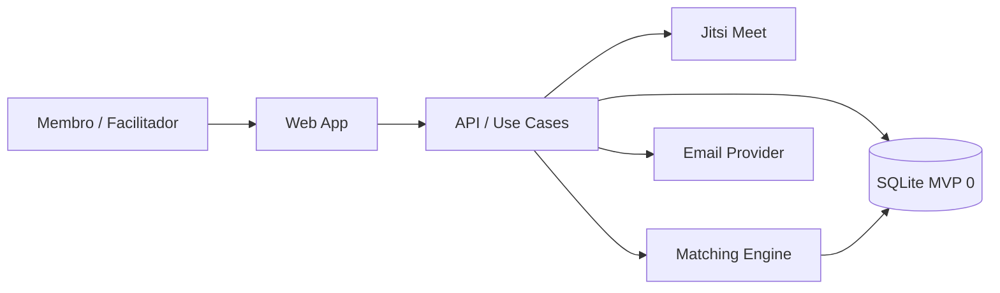

# 05 — Architecture

> **Gate:** `status: approved` required before epics, versions, and user stories in SQLite.

## Objective

Descreve a arquitetura lógica do Ember: comunidades fechadas, perfis de disponibilidade, motor de matching e formação de círculos (Fogo de Conselho como primeiro template). Stack concreta permanece candidata até `01` approved.

## System context



**Repository layout (high level):**

```txt
/
  apps/web/              # Vite + React — presença, convites
  apps/api/              # Node API — rodadas, matching, email, Jitsi, .ics
  packages/
    domain/              # matching, rodas, ritual Fogo de Conselho
    db/                  # schema SQLite, migrations, repositories
  mockup/                # HTML editorial de apresentação (referência visual)
  docs/                  # phase docs Meridian
  .agent/                # kit Meridian
```

## Layers and boundaries

| Layer | Responsibility | Paths | Depends on |
| ----- | -------------- | ----- | ---------- |
| UI | onboarding, perfil, convites, painel facilitador | `apps/web/src/` | API hooks |
| API / handlers | auth, CRUD, trigger matching | `apps/web/src/app/api/` | use cases |
| Application | orquestração de rodadas, convites | `packages/domain/use-cases/` | domain + repos |
| Domain | matching, círculos, disponibilidade | `packages/domain/` | — |
| Infrastructure | DB, email | `packages/db/`, adapters | domain ports |

## Major components

| Component | Purpose | Tech | Owner module |
| --------- | ------- | ---- | -------------- |
| CommunityService | CRUD comunidade, membros, roles | TS | `domain/community` |
| ProfileService | disponibilidade, idiomas, preferências | TS | `domain/profile` |
| MatchingEngine | forma círculos com scoring (novidade, ponte, idioma, fuso) | TS puro | `domain/matching` |
| CircleService | ciclo de vida do círculo (draft → invited → confirmed) | TS | `domain/circle` |
| MeetingTemplateRegistry | Fogo de Conselho e futuros rituais | TS | `domain/templates` |
| InviteService | email + link assinado + gravação `sent_emails` | adapter | `infra/email` — ver `architecture/email.md` |
| AuthAdapter | magic link / OAuth | Supabase Auth `(candidate)` | `infra/auth` |

## Integration points

| System | Direction | Protocol | Auth | Failure mode |
| ------ | --------- | -------- | ---- | ------------ |
| Email (Resend/SendGrid) | outbound | REST | API key | retry 3x; log falha |
| Supabase Auth `(candidate)` | inbound | SDK | JWT | fail closed |
| Jitsi Meet | outbound | URL/API | room per roda | link no email |
| `.ics` calendar | outbound | file attach | n/a | gerado por roda |

## Key flows

### Flow 1 — Onboarding de membro

1. Admin envia convite por email com token assinado.
2. Membro clica link → auth → cria perfil (fuso, idiomas, disponibilidade semanal).
3. Perfil marcado como `ready_for_matching`.

### Flow 2 — Rodada de matching (Fogo de Conselho)

1. Facilitador configura pergunta da semana e dispara rodada.
2. `MatchingEngine` carrega membros `ready` da comunidade.
3. Engine forma trios com pesos: (a) horário em comum — essencial, (b) idioma em comum — essencial, (c) novos encontros — prioridade, (d) gerações/geografias diferentes — ponte. Ver `docs/discovery/orientacao-produto.md`.
4. `CircleService` cria círculos em estado `invited`; `InviteService` notifica os 3 membros.
5. Membros confirmam; ao atingir 3 confirmações, círculo → `confirmed` com horário e pergunta.

### Flow 3 — Confirmação, encontro e pós-rodada

1. Membro abre convite → confirma presença na roda.
2. Roda publicada: email com horário, pergunta, link Jitsi e `.ics`.
3. Após o slot: pergunta **"A roda aconteceu?"** — registra presença real para memória do matching.

## Architecture detail files

| File | Topic | Status |
| ---- | ----- | ------ |
| `docs/architecture/email.md` | envio, `sent_emails`, Mailpit (padrão Osmo) | draft |
| `docs/architecture/matching.md` | pesos do sorteio com memória | planned |
| `docs/architecture/fogo-de-conselho.md` | ritual piloto — template configurável | planned |

## Cross-cutting concerns

| Concern | Approach | Doc ref |
| ------- | -------- | ------- |
| Auth | magic link + RBAC por community | `02_security` |
| Logging | structured JSON, sem PII | `08_environments` |
| Feature flags | env var na v1 | `08` |
| Timezones | armazenar tudo em UTC; exibir no fuso do membro | `06_database` |

## Mode B — as-is vs target

Greenfield — sem código legado.

## Gaps / open questions

| # | Gap | Blocks backlog |
| - | --- | -------------- |
| 1 | Algoritmo de scoring — pesos exatos novidade vs ponte vs idioma | yes — epic matching |
| 2 | Re-match automático quando membro recusa na mesma rodada | yes — US convites |
| 3 | Stack e layout de monorepo final | yes — bootstrap código |

## Gate

Only **human** sets `status: approved`. Run `/architecture` before approval.
