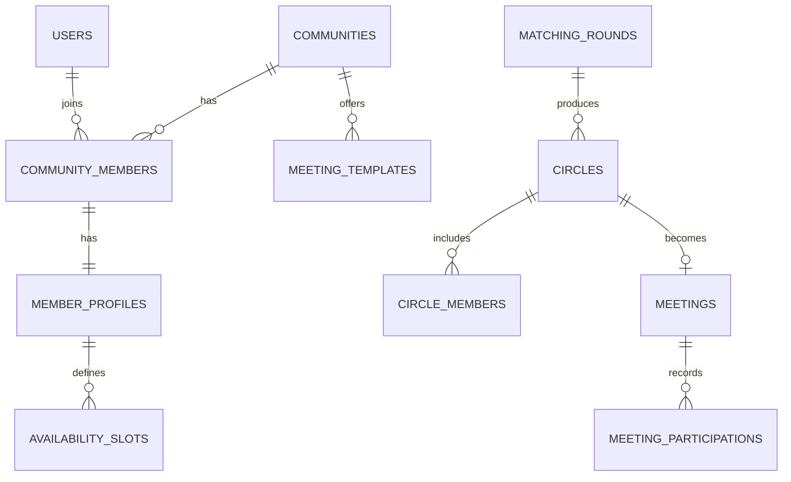

# 06 — Database

## Persistence model

| Attribute | Value |
| --------- | ----- |
| **Primary store** | PostgreSQL `(candidate)` |
| **ORM / client** | Drizzle ou Prisma `(candidate)` |
| **Connection config** | `DATABASE_URL` |
| **Multi-tenant** | yes — `community_id` em todas as tabelas de domínio |

## Schema overview

### Entity list

| Entity / table | Purpose | Owner service | PII? |
| -------------- | ------- | ------------- | ---- |
| `communities` | tenant / comunidade anfitriã | CommunityService | no |
| `users` | identidade global (auth) | AuthAdapter | yes |
| `community_members` | vínculo user ↔ community + role | CommunityService | yes |
| `member_profiles` | disponibilidade, idiomas, fuso | ProfileService | yes |
| `availability_slots` | janelas recorrentes (dia, hora UTC) | ProfileService | no |
| `meeting_templates` | Fogo de Conselho, etc. | MeetingTemplateRegistry | no |
| `matching_rounds` | rodada disparada pelo facilitador | MatchingEngine | no |
| `circles` | trio formado em uma rodada | CircleService | no |
| `circle_members` | participantes + status convite | CircleService | yes |
| `meetings` | encontro confirmado (horário, pergunta, link) | CircleService | no |
| `meeting_participations` | histórico para scoring futuro | MatchingEngine | no |
| `sent_emails` | auditoria de e-mails enviados (hash + vault) | EmailService | yes |

### Relationships

## Migrations

| Rule | Value |
| ---- | ----- |
| Tool | SQL files `(candidate: Supabase migrations)` |
| Folder | `supabase/migrations/` |
| Naming | `YYYYMMDDHHMMSS_description.sql` |
| Apply in CI | yes — antes de deploy |
| Rollback policy | forward-only na v1; rollback manual se crítico |

## Data access rules

| Layer | May write DB | May read DB |
| ----- | ------------ | ----------- |
| API handlers | via repositories | via repositories |
| Domain | no | no — só ports |
| Scripts | migration tool only | — |

## Indexes and performance

| Table | Index | Reason |
| ----- | ----- | ------ |
| `community_members` | `(community_id, user_id)` unique | lookup membro |
| `meeting_participations` | `(user_id, community_id)` | histórico para matching |
| `availability_slots` | `(member_profile_id)` | join no matching |

## Backup and restore

| Environment | Method | Frequency | RTO / RPO |
| ----------- | ------ | --------- | --------- |
| local | docker volume / supabase local | n/a | n/a |
| production | provider automated | daily | a definir com hosting |

## Security

- Encryption at rest: provider default
- Row-level security: habilitar por `community_id` se Supabase Auth
- Ver `02_security` § Data classification

## Gaps / open questions

| # | Gap | Evidence needed |
| - | --- | --------------- |
| 1 | Normalização de idiomas (tabela vs array JSON) | decisão de schema |
| 2 | Armazenar grafo de 2º grau explicitamente ou calcular on-the-fly | perf test matching |

## Gate

Human `approved` when schema matches deployment reality.
