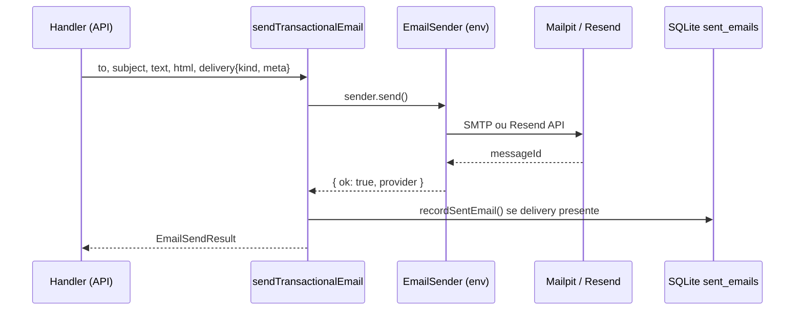

# Email — arquitetura (padrão Osmo)

> **Escopo deste doc:** apenas a infraestrutura transacional de e-mail — envio, gravação em SQLite, providers e Mailpit em dev. Não cobre WhatsApp (MVP 2) nem UI admin de histórico (opcional pós-piloto).

Ember copia o **padrão comprovado do Osmo** (`packages/licensing/server`), renomeando prefixos de env e adaptando `kind` + `meta` ao domínio de comunidades e rodadas — **sem** acoplamento a licenças, Stripe ou linguagem de um piloto específico.

## Princípios

| Princípio | Detalhe |
| --------- | ------- |
| Síncrono na v1 | Sem fila/worker — `await sendTransactionalEmail()` no handler |
| Default seguro | Provider `noop` se env não configurado — nunca envia por acidente |
| Grava só se OK | `sent_emails` apenas após `result.ok === true` |
| Privacidade | Destinatário: hash + vault reversível; corpo: vault AES-GCM |
| Dev local | SMTP → Mailpit (`:1025` / UI `:8025`) |
| Produção | Resend via `fetch` (sem SDK), mesmo padrão Osmo |

## Fluxo



## Providers (`EMBER_EMAIL_PROVIDER`)

| Valor | Classe | Uso |
| ----- | ------ | --- |
| *(vazio)* | `NoopEmailSender` | CI, ambientes sem config |
| `logging` | `LoggingEmailSender` | Debug — loga corpo no console |
| `smtp` | `SmtpEmailSender` (nodemailer) | Dev com Mailpit |
| `resend` | `ResendEmailSender` (fetch) | Staging / produção |

Factory espelha `osmo/.../create-email-sender.ts` — singleton em cache, `resetEmailSenderCacheForTests()` para testes.

## Variáveis de ambiente

```bash
# Provider
EMBER_EMAIL_PROVIDER=smtp          # noop | logging | smtp | resend
EMBER_EMAIL_FROM="Ember <dev@localhost>"

# SMTP (dev / Mailpit)
EMBER_SMTP_HOST=127.0.0.1
EMBER_SMTP_PORT=1025
EMBER_SMTP_SECURE=false
EMBER_SMTP_USER=
EMBER_SMTP_PASS=

# Resend (prod)
RESEND_API_KEY=re_...

# Persistência (hash + vault)
EMBER_EMAIL_PEPPER=change-me-local-dev
EMBER_DB_PATH=data/ember.db

# App (links nos templates)
EMBER_APP_URL=http://localhost:3000
```

## Módulos a portar do Osmo

Caminho fonte → destino Ember (`apps/api/src/` ou `packages/email/`):

| Osmo | Ember | Notas |
| ---- | ----- | ----- |
| `email-send.ts` | `email-send.ts` | Remover `stripeSessionId`; manter `delivery` |
| `email-delivery-context.ts` | `email-delivery-context.ts` | Factory DB + pepper |
| `record-sent-email.ts` | `record-sent-email.ts` | Sem `licenseKey` — usar `meta` |
| `sent-emails-db.ts` | `sent-emails-db.ts` | CRUD + listagem admin (opcional) |
| `sent-email-body-vault.ts` | idem | Encrypt html/text |
| `sent-email-redact.ts` | `redact-sent-email-body.ts` | Redigir magic links completos se necessário |
| `crypto/vault-crypto.ts` | idem | AES-256-GCM |
| `crypto/license-email-vault.ts` | `recipient-email-vault.ts` | Hash + vault do destinatário |
| `email/create-email-sender.ts` | idem | Prefixo `EMBER_` |
| `email/smtp-email-sender.ts` | idem | |
| `email/resend-email-sender.ts` | idem | |
| `email/noop-email-sender.ts` | idem | |
| `email/logging-email-sender.ts` | idem | |
| `email/misconfigured-email-sender.ts` | idem | |
| `email/smtp-config.ts` | idem | Default `127.0.0.1:1025` |
| `email/email-env.ts` | idem | `resolveEmailFrom()`, URLs |
| `email/email-layout.ts` | idem | Layout HTML Ember (tokens `09_design_system`) |
| `email/email-brand.ts` | idem | Logo CID inline |
| `email/*-templates.ts` | por `kind` | Ver tabela abaixo |

**Dependências:** `nodemailer`, `better-sqlite3` (mesmas versões do Osmo).

## Schema `sent_emails`

Adaptação da migration Osmo `20260818182624_sent_emails.sql` — **sem** `license_key_prefix`:

```sql
CREATE TABLE IF NOT EXISTS sent_emails (
  id TEXT PRIMARY KEY,
  email_hash TEXT NOT NULL,
  email_vault TEXT,
  kind TEXT NOT NULL,
  subject TEXT NOT NULL,
  provider TEXT NOT NULL,
  meta_json TEXT,
  html_vault TEXT,
  text_vault TEXT,
  sent_at TEXT NOT NULL
);

CREATE INDEX IF NOT EXISTS idx_sent_emails_email_hash ON sent_emails (email_hash);
CREATE INDEX IF NOT EXISTS idx_sent_emails_kind ON sent_emails (kind);
CREATE INDEX IF NOT EXISTS idx_sent_emails_sent_at ON sent_emails (sent_at DESC);
```

### `meta_json` (Ember)

Campos opcionais por envio — JSON livre, sem PII em claro:

| Campo | Exemplo | Uso |
| ----- | ------- | --- |
| `community_id` | `uuid` | tenant |
| `round_id` | `uuid` | rodada |
| `circle_id` | `uuid` | roda formada |
| `member_id` | `uuid` | destinatário interno |
| `locale` | `pt` | template language |

## Kinds de e-mail — MVP 0

| `kind` | Quando dispara | Conteúdo mínimo |
| ------ | -------------- | --------------- |
| `magic_link` | Login / convite inicial | Link assinado, expiração |
| `round_open` | Facilitador abre rodada | Slots disponíveis, CTA declarar presença |
| `circle_formed` | Roda publicada | Trio, horário (fuso local), pergunta, link Jitsi, `.ics` |
| `circle_reminder` | MVP 1 — 24h / 15min | Horário, link Jitsi |

**Fora do MVP 0:** `admin_*`, lembretes automáticos, digest semanal.

Templates: funções TypeScript → `{ subject, text, html }` — **sem** React Email, mesmo padrão Osmo.

## Mailpit (dev)

Portar `osmo/scripts/dev/mailpit.mjs` → `scripts/dev/mailpit.mjs`:

- Portas em `config/dev-ports.json`: `mailpitSmtp: 1025`, `mailpitWeb: 8025`
- Preferir `brew install mailpit`; fallback Docker `axllent/mailpit`
- UI: `http://127.0.0.1:8025`

### Setup local

```bash
node scripts/dev/mailpit.mjs
# Em outro terminal, API com:
EMBER_EMAIL_PROVIDER=smtp
EMBER_SMTP_HOST=127.0.0.1
EMBER_SMTP_PORT=1025
EMBER_EMAIL_FROM="Ember <dev@localhost>"
```

## Padrão de uso no caller

```typescript
import { sendTransactionalEmail } from './email-send';
import { createEmailDeliveryContext } from './email-delivery-context';
import { buildCircleFormedEmail } from './email/circle-formed-templates';

const content = buildCircleFormedEmail({ locale: 'pt', ... });
await sendTransactionalEmail({
  to: member.email,
  subject: content.subject,
  text: content.text,
  html: content.html,
  delivery: createEmailDeliveryContext({
    kind: 'circle_formed',
    meta: { community_id, round_id, circle_id, locale: 'pt' },
  }),
});
```

## Segurança e LGPD

- Pepper (`EMBER_EMAIL_PEPPER`) nunca no Git — `.env.example` só com placeholder
- Logs: domínio do destinatário, `kind`, `provider` — **não** logar corpo nem e-mail completo
- Admin que lista `sent_emails` vê e-mail mascarado via vault (padrão Osmo)
- Retenção: alinhar com `02_security` — exclusão sob pedido do titular

## Fora de escopo (este doc)

| Item | Onde |
| ---- | ---- |
| UI admin "emails enviados" | Pós-MVP 0 — copiar `sent-emails-admin.ts` do Osmo se necessário |
| Fila / retry / dead letter | MVP 1+ se volume exigir |
| WhatsApp como canal | `roadmap.md` MVP 2 |
| Templates por comunidade custom | Um layout Ember; copy por `locale` apenas |

## Critérios de aceite — slice email MVP 0

- [ ] `EMBER_EMAIL_PROVIDER=noop` por default — testes não enviam email real
- [ ] `smtp` + Mailpit: e-mail visível na UI `:8025`
- [ ] `resend` em staging com API key real
- [ ] Todo envio transacional com `delivery` grava linha em `sent_emails`
- [ ] Falha de envio **não** grava registro
- [ ] Templates `magic_link`, `round_open`, `circle_formed` em PT (EN opcional no mesmo padrão da UI)
- [ ] `.ics` anexo ou link no e-mail `circle_formed` (definir em US dedicada)

## Referência Osmo

| Artefato | Path |
| -------- | ---- |
| Orquestrador | `packages/licensing/server/src/email-send.ts` |
| Migration | `migrations/20260818182624_sent_emails.sql` |
| Mailpit script | `scripts/dev/mailpit.mjs` |
| Env exemplo | `apps/site/.env.development` |

## Gate

Human `approved` antes de implementar US de e-mail no MVP 0. Implementação deve **copiar** estrutura Osmo, não reinventar.
